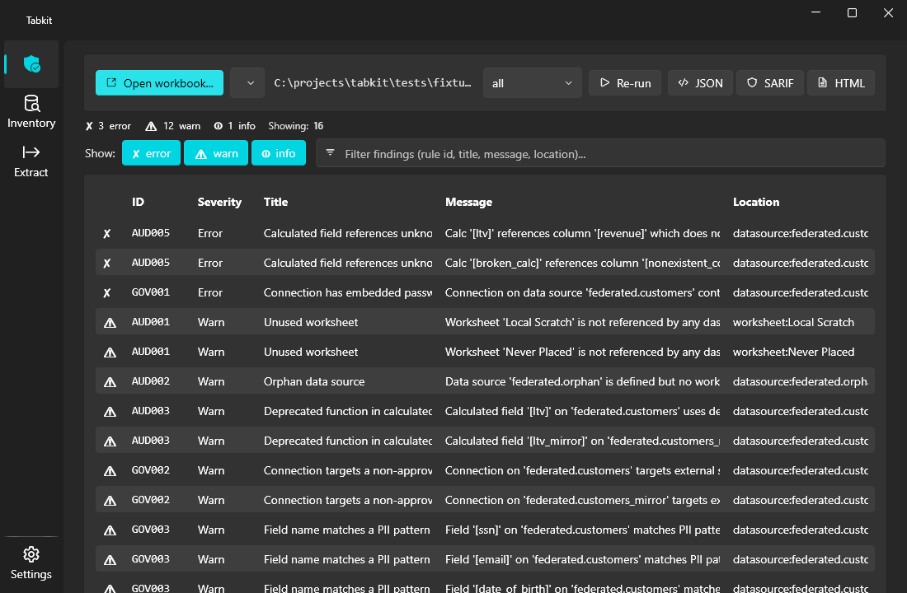
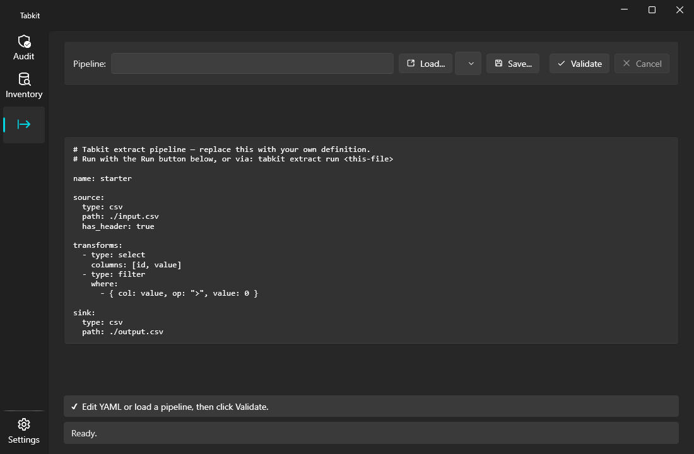

# tabkit

On-prem static analysis, fleet inventory, and Hyper-extract toolkit for Tableau workbooks. Code-first. No Tableau Server. No vendor SaaS. No bundled runtime.

[](#)
[](LICENSE)
[](https://dot.net)

`tabkit` reads `.twb` / `.twbx` files directly — no Tableau Server, no REST API, no account. A single .NET 10 solution ships a cross-platform CLI and a Windows desktop app on top of one shared engine. Point it at a workbook or a whole shared drive and get governance findings, a queryable fleet inventory, and a code-first replacement for trivial Prep Builder flows.

## Preview

The desktop app — Audit page, governance + analysis findings over a workbook:



The Extract page — declarative YAML pipelines that replace trivial Prep flows:



## Why

Tableau shops accumulate three problems no native tool solves:

1. **Workbook sprawl** — hundreds of `.twbx` files on shared drives with no inventory. Which workbook touches `dbo.orders`? Which has embedded credentials? Nobody knows.
2. **Governance gap** — no built-in scan for PII column references, hardcoded credentials, external data connections, or `USERNAME()`-based ad-hoc row-level security.
3. **Prep Builder lock-in** — many production Prep flows are trivial reshapes that should be 30 lines of declarative YAML. License cost and GUI-only authoring are the only things holding them in `.tfl`.

`tabkit` is three tools sharing one engine that answer those three problems.

## The three tools

### `tabkit audit`
Static analysis with pluggable rule packs. Two ship today (`audit` + `governance`); 11 rules covering unused worksheets, deprecated functions, broken column references, duplicate calcs, embedded credentials, PII patterns, external server connections, ad-hoc RLS, user-profile filesystem paths, and old workbook versions. Output as text, JSON, SARIF 2.1.0, or single-file HTML.

```
tabkit audit run dashboard.twbx
tabkit audit run dashboard.twbx --format html --out report.html
tabkit audit run dashboard.twbx --format sarif --out audit.sarif   # CI-friendly
tabkit audit diff v1.twbx v2.twbx                                  # semantic + canonical XML diff
tabkit audit inspect --pack governance                             # list rules + descriptions
```

### `tabkit inventory`
Fleet scanner. Walks a tree, indexes every `.twb` / `.twbx` into SQLite with paths, hashes, connections, referenced tables, calculated-field formulas, and last-saved versions. Then query the index across the whole estate.

```
tabkit inventory scan \\fileserver\tableau --db fleet.sqlite
tabkit inventory stats --db fleet.sqlite
tabkit inventory find --db fleet.sqlite --with-embedded-creds
tabkit inventory find --db fleet.sqlite --references-table Sales
tabkit inventory find --db fleet.sqlite --uses-username
```

### `tabkit extract`
Code-first replacement for trivial Prep Builder flows. YAML pipelines. Reads CSV / Parquet / SQL Server, applies transforms (cast / filter / rename / select / drop), writes `.hyper` / CSV / Parquet. Runs once, exits — schedule it however your org already schedules things.

```
tabkit extract validate pipelines/orders.yml
tabkit extract run pipelines/orders.yml
```

See [examples/pipelines](examples/pipelines/) for working YAML examples.

## Two surfaces

| Surface | When to use it |
|---|---|
| **CLI** (`tabkit ...`) | CI pipelines, scripting, pre-commit hooks, scheduled jobs. Exit codes follow the standard 0 / 1 / 2 contract (clean / warning / error). Runs anywhere .NET 10 does. |
| **Desktop app** (`tabkit-app`) | Analysts and governance leads who want a visual surface. WPF-UI Fluent on .NET 10, drag-drop, severity filtering, export to JSON / SARIF / HTML. Windows only. |

See [docs/architecture.md](docs/architecture.md) for the engine layout and where each surface plugs in.

## Install

### Desktop app — Windows installer

Build the installer from source (requires [NSIS](https://nsis.sourceforge.io) and the .NET 10 SDK):

```
pwsh .\installer\build.ps1
```

This publishes the WPF app and produces `installer\Tabkit-Setup-<version>.exe` — a
per-user installer (no admin elevation) that adds Start-menu / desktop shortcuts and an
uninstaller. It's framework-dependent, so the target machine needs the
[.NET 10 Desktop Runtime](https://dotnet.microsoft.com/download/dotnet/10.0) (the
installer checks for it and warns if it's missing). See [installer/](installer/) for the
NSIS script and branding assets.

### Build from source

```
git clone https://github.com/jasonulbright/tabkit.git
cd tabkit

# Build everything
dotnet build Tabkit.slnx -c Release

# CLI binary
src\Tabkit.Cli\bin\Release\net10.0\tabkit.exe --help

# Desktop app
src\Tabkit.App\bin\Release\net10.0-windows\tabkit-app.exe
```

Requirements:
- .NET 10 SDK
- Windows for the desktop app (`net10.0-windows`); the CLI runs anywhere .NET 10 does
- NSIS, only if building the installer

## What rules ship

### Audit pack

| ID | Severity | What it catches |
|---|---|---|
| `AUD001` | warn  | Worksheet not placed on any dashboard |
| `AUD002` | warn  | Data source with zero worksheet references |
| `AUD003` | warn  | Calculated field uses deprecated function (`ATTR`, `WINDOW_VAR`, ...) |
| `AUD004` | info  | Identical calculation appears in multiple data sources |
| `AUD005` | error | Calc references a column that doesn't exist on the data source |
| `AUD006` | info  | Workbook XML version below the modern floor |

### Governance pack

| ID | Severity | What it catches |
|---|---|---|
| `GOV001` | error | Connection has an embedded password |
| `GOV002` | warn  | Connection targets a server not on the configured allowlist |
| `GOV003` | warn  | Field name matches a PII pattern (`ssn`, `dob`, `email`, `phone`, `address`, `credit_card`, `medical`, `personal_name`, `ip_address`) |
| `GOV004` | warn  | Calc uses `USERNAME()` / `ISMEMBEROF()` / `FULLNAME()` for ad-hoc access control |
| `GOV005` | warn  | Connection references a user-profile filesystem path (`C:\Users\...`, `/home/...`, `/Users/...`) |

Both packs are configurable at runtime — GOV002 takes an allowlist, GOV003 takes a per-pattern enable/disable. See `GovernanceConfig` in `Tabkit.Core/Audit/` or the **Settings** page in the desktop app.

## Output formats

- **Text** — Spectre.Console table with severity glyphs. Default for the CLI; piped output stays readable.
- **JSON** — structured findings dump for downstream tooling. `tool` / `version` / `findings[]` shape.
- **SARIF 2.1.0** — drops into VS Code's SARIF Viewer, GitHub PR Code Scanning, or Azure DevOps build pipelines. Conforms to the official OASIS schema.
- **HTML** — single-file dark-theme report. No JS framework, no bundled runtime, opens in any browser, emails cleanly.

## Safety properties

- **Passwords are never exposed.** The model surfaces connection passwords only as `has_password: bool`, never as the value. Same in JSON / SARIF / HTML output.
- **No telemetry.** Tabkit doesn't phone home. The Hyper API has its own telemetry flag — tabkit always passes `Telemetry.DoNotSendUsageDataToTableau`.
- **No `eval`.** Pipeline filter clauses are explicit `{col, op, value}` records — no user-supplied expression evaluation, no embedded scripting.

## Examples

- **Pipelines:** [examples/pipelines](examples/pipelines/) — working YAML pipelines.
- **Audit reports:** [examples/reports](examples/reports/) — pre-rendered HTML reports.

## License

[MIT](LICENSE). Use it, fork it, ship it.
